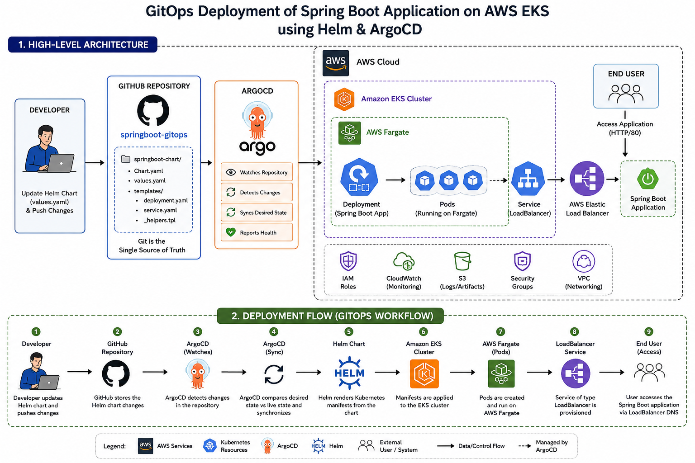
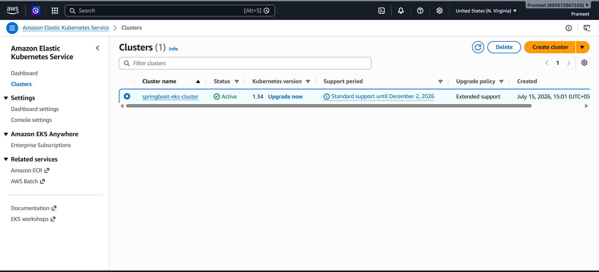
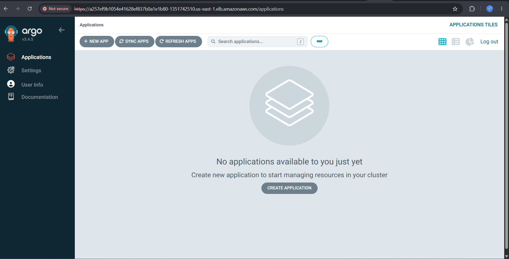
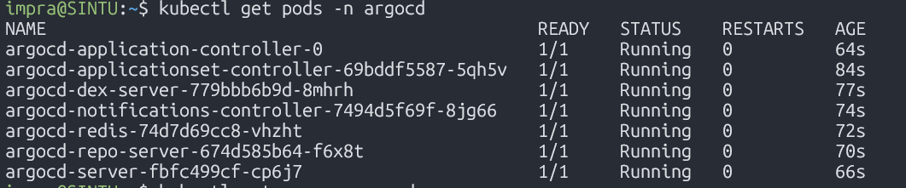
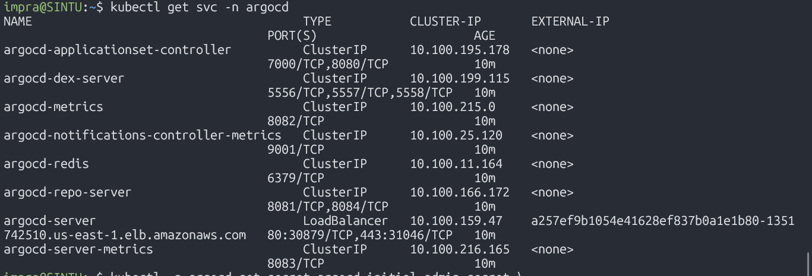
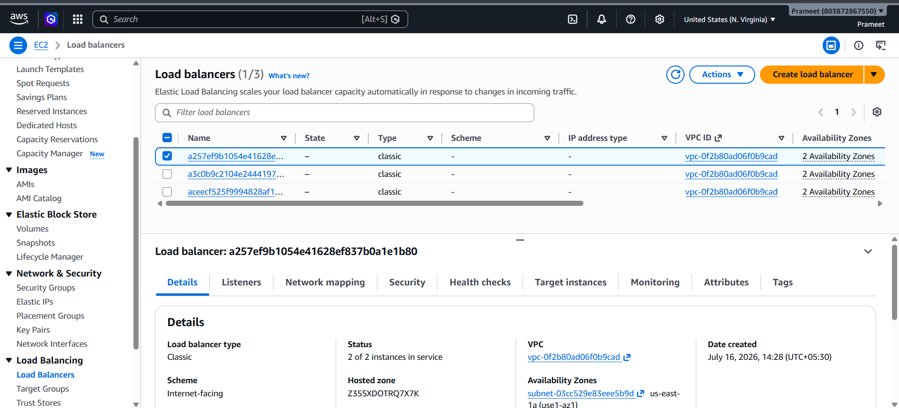

# 🚀 GitOps Deployment of Spring Boot Application on AWS EKS using Helm & ArgoCD

<p align="center">


</p>

---

# 📖 Project Overview

This repository demonstrates a **production-style GitOps deployment** of a **Spring Boot application** on **Amazon Elastic Kubernetes Service (EKS)** using **AWS Fargate**, **Helm**, and **ArgoCD**.

The project follows the **GitOps methodology**, where Git serves as the **single source of truth** for application deployment. Instead of manually applying Kubernetes manifests, deployment configurations are stored in GitHub and automatically synchronized to the Kubernetes cluster by ArgoCD.

The application is packaged as a reusable **Helm Chart**, enabling version-controlled, repeatable, and configurable deployments. Running the workload on **AWS Fargate** removes the need to manage Kubernetes worker nodes while still providing a fully managed Kubernetes experience.

This project reflects modern DevOps practices commonly used in production environments, including declarative infrastructure, continuous deployment, automated synchronization, and Kubernetes-based application management.

---

# 📋 Project Information

| Property | Value |
|-----------|-------|
| **Project Name** | Spring Boot GitOps Deployment |
| **Cloud Platform** | Amazon Web Services (AWS) |
| **Container Orchestration** | Amazon EKS |
| **Compute Platform** | AWS Fargate |
| **GitOps Tool** | ArgoCD |
| **Package Manager** | Helm |
| **Application** | Spring Boot |
| **Programming Language** | Java |
| **Container Runtime** | Docker |
| **Docker Image** | `prameet26/springboot-cicd:latest` |
| **Deployment Strategy** | GitOps |
| **Repository** | GitHub |
| **Service Exposure** | AWS Elastic Load Balancer |

---

# 📑 Table of Contents

- 📖 Project Overview
- 📋 Project Information
- 🎯 Project Objectives
- ⭐ Key Features
- 🛠️ Technology Stack
- 📦 Docker Image
- 🏗️ Solution Architecture
- 🔄 GitOps Deployment Workflow
- 📂 Repository Structure
- ⚙️ Prerequisites
- ☁️ AWS Services Used
- 🚀 Deployment Steps
- 🔍 Verification Commands
- 📦 Helm Chart Overview
- 🔄 ArgoCD Synchronization
- 📸 Project Screenshots
- 🧪 Testing the Application
- ⚠️ Challenges Faced
- 🛠️ Troubleshooting
- 🚀 Best Practices Followed
- 🎤 Interview Talking Points
- 🏆 Skills Demonstrated
- 🎯 Learning Outcomes
- 📈 Future Enhancements
- 🧹 Cleanup Commands
- 📚 Useful Commands
- 🤝 Contributing
- ⭐ Support
- 👨‍💻 Author
- 📜 License

---

# 🎯 Project Objectives

The primary objectives of this project are:

- Deploy a Spring Boot application on Amazon EKS.
- Run Kubernetes workloads using AWS Fargate.
- Package the application using Helm Charts.
- Implement GitOps deployment using ArgoCD.
- Automate application synchronization from GitHub.
- Expose the application using an AWS LoadBalancer Service.
- Demonstrate declarative Kubernetes deployments.
- Understand production-ready GitOps workflows.
- Gain practical experience with cloud-native deployment practices.

---

# ⭐ Key Features

- GitOps-based Continuous Deployment
- Amazon EKS Cluster
- AWS Fargate Serverless Compute
- Helm Chart Packaging
- ArgoCD Continuous Synchronization
- Declarative Kubernetes Resources
- Docker Image Deployment
- Kubernetes Deployment & Service
- AWS Elastic Load Balancer Integration
- Version-controlled Infrastructure
- Automatic Cluster Reconciliation
- Production-style Kubernetes Deployment

---

# 🛠️ Technology Stack

| Category | Technology |
|-----------|------------|
| Cloud Provider | Amazon Web Services (AWS) |
| Container Runtime | Docker |
| Container Registry | Docker Hub |
| Container Orchestration | Amazon EKS |
| Compute Platform | AWS Fargate |
| GitOps Tool | ArgoCD |
| Package Manager | Helm |
| Version Control | Git & GitHub |
| Application Framework | Spring Boot |
| Programming Language | Java |
| Kubernetes Resources | Deployment, Service |
| Networking | AWS Elastic Load Balancer |

---

# 📦 Docker Image

The application deployed in this project uses the following Docker image hosted on Docker Hub:

```text
prameet26/springboot-cicd:latest
```

This image is referenced by the Helm Chart and deployed automatically to Amazon EKS through the GitOps workflow managed by ArgoCD.

---

# 🏗️ Solution Architecture

> **Architecture Diagram**

After uploading the architecture diagram, replace the placeholder below.

```text
screenshots/architecture-diagram.png
```

```markdown
<p align="center">

</p>
```

---

# 🔄 GitOps Deployment Workflow

```text
                           +----------------------+
                           |     Developer        |
                           +----------+-----------+
                                      |
                          Push Helm Chart Changes
                                      |
                                      ▼
                      +-------------------------------+
                      | GitHub Repository             |
                      | springboot-gitops             |
                      +---------------+---------------+
                                      |
                         ArgoCD Watches Repository
                                      |
                                      ▼
                          +-------------------------+
                          |        ArgoCD           |
                          | Continuous Sync         |
                          +-----------+-------------+
                                      |
                           Deploy Helm Release
                                      |
                                      ▼
               +------------------------------------------------+
               |          Amazon EKS Cluster                     |
               |------------------------------------------------|
               |                                                |
               |  AWS Fargate                                   |
               |      │                                         |
               |      ▼                                         |
               |  Spring Boot Deployment                        |
               |      │                                         |
               |      ▼                                         |
               |  Kubernetes Service (LoadBalancer)             |
               +----------------------+-------------------------+
                                      |
                                      ▼
                        AWS Elastic Load Balancer
                                      |
                                      ▼
                           Spring Boot REST API
```

---

# 📌 Why GitOps?

GitOps is a modern operational model where **Git acts as the single source of truth** for Kubernetes deployments.

Instead of manually applying Kubernetes manifests, all deployment configurations are stored in a Git repository. ArgoCD continuously monitors the repository, detects changes, and automatically synchronizes the Kubernetes cluster to match the desired state.

### Benefits of GitOps

- Declarative deployments
- Version-controlled infrastructure
- Automated synchronization
- Easy rollback using Git history
- Improved deployment consistency
- Better collaboration across teams
- Reduced manual operational effort
- Enhanced auditability and traceability

---
# 📂 Repository Structure

```text
springboot-gitops/
│
├── springboot-chart/
│   ├── Chart.yaml
│   ├── values.yaml
│   ├── README.md
│   ├── templates/
│   │   ├── deployment.yaml
│   │   ├── service.yaml
│   │   ├── _helpers.tpl
│   │   └── NOTES.txt
│   └── .helmignore
│
├── screenshots/
│   ├── architecture-diagram.png
│   ├── eks-cluster.png
│   ├── argocd-dashboard.png
│   ├── pods.png
│   ├── services.png
│   ├── loadbalancer.png
│   ├── application.png
│   └── github-repository.png
│
├── .gitignore
├── LICENSE
└── README.md
```

The repository is organized to keep deployment manifests, Helm templates, documentation, and screenshots separate, making the project easier to understand and maintain.

---

# ⚙️ Prerequisites

Before deploying this project, ensure the following tools are installed and configured.

| Tool | Purpose |
|------|---------|
| AWS CLI | Authenticate and manage AWS resources |
| kubectl | Interact with the Kubernetes cluster |
| eksctl | Create and manage Amazon EKS clusters |
| Helm | Package and deploy Kubernetes applications |
| Docker | Build and manage container images |
| Git | Clone and manage the repository |
| ArgoCD CLI *(Optional)* | Manage ArgoCD from the command line |

---

# ☁️ AWS Services Used

This project makes use of the following AWS services.

| Service | Purpose |
|----------|---------|
| Amazon EKS | Managed Kubernetes cluster |
| AWS Fargate | Serverless compute for Kubernetes Pods |
| Elastic Load Balancer | Exposes the application externally |
| IAM | Permissions for EKS and AWS resources |
| Amazon VPC | Networking for the Kubernetes cluster |
| Security Groups | Control inbound and outbound traffic |
| AWS CloudFormation | Automatically provisions EKS resources through `eksctl` |

---

# 🚀 Deployment Steps

## Step 1 — Create the Amazon EKS Cluster

Create a new EKS cluster using AWS Fargate.

```bash
eksctl create cluster \
  --name springboot-eks-cluster \
  --region us-east-1 \
  --fargate
```

Verify the cluster:

```bash
kubectl get nodes
```

> **Note:** Since this project uses AWS Fargate, Kubernetes worker nodes are managed by AWS.

---

## Step 2 — Configure kubectl

Update your local kubeconfig.

```bash
aws eks update-kubeconfig \
  --region us-east-1 \
  --name springboot-eks-cluster
```

Verify the connection.

```bash
kubectl cluster-info
```

---

## Step 3 — Create the Application Namespace

```bash
kubectl create namespace springboot
```

Verify:

```bash
kubectl get namespaces
```

---

## Step 4 — Install ArgoCD

Create the ArgoCD namespace.

```bash
kubectl create namespace argocd
```

Install ArgoCD.

```bash
kubectl apply -n argocd \
-f https://raw.githubusercontent.com/argoproj/argo-cd/stable/manifests/install.yaml
```

Verify installation.

```bash
kubectl get pods -n argocd
```

---

## Step 5 — Access the ArgoCD Dashboard

Forward the ArgoCD service locally.

```bash
kubectl port-forward svc/argocd-server \
-n argocd 8080:443
```

Open:

```text
https://localhost:8080
```

Retrieve the initial administrator password.

```bash
kubectl \
-n argocd \
get secret argocd-initial-admin-secret \
-o jsonpath="{.data.password}" | base64 -d
```

Log in using:

- Username: `admin`
- Password: *(output of the command above)*

---

## Step 6 — Clone the Repository

```bash
git clone https://github.com/Prameet-26/springboot-gitops.git

cd springboot-gitops
```

---

## Step 7 — Helm Chart Overview

The application is packaged as a reusable Helm Chart.

```text
springboot-chart/
│
├── Chart.yaml
├── values.yaml
└── templates/
    ├── deployment.yaml
    ├── service.yaml
    ├── _helpers.tpl
    └── NOTES.txt
```

The Helm Chart manages:

- Kubernetes Deployment
- Kubernetes Service
- Labels
- Docker Image configuration
- Replica count
- Service type
- Container ports

Application configuration is maintained through `values.yaml`, allowing deployments to be customized without modifying Kubernetes manifests.

---

## Step 8 — Create the ArgoCD Application

Configure a new application in the ArgoCD dashboard.

| Field | Value |
|-------|-------|
| Application Name | `springboot-gitops` |
| Repository URL | `https://github.com/Prameet-26/springboot-gitops.git` |
| Path | `springboot-chart` |
| Cluster | `https://kubernetes.default.svc` |
| Namespace | `default` |

Enable the following options:

- ✅ Automatic Sync
- ✅ Self Heal
- ✅ Prune Resources

Click **Create**.

---

## Step 9 — Automatic GitOps Deployment

Once the application is created:

1. ArgoCD monitors the GitHub repository.
2. Detects changes to the Helm Chart.
3. Generates Kubernetes manifests.
4. Deploys resources to Amazon EKS.
5. Continuously monitors cluster state.
6. Automatically reconciles configuration drift.

This automated synchronization ensures that the Kubernetes cluster always matches the desired state stored in Git.

---

# 🔍 Verification Commands

Verify Pods

```bash
kubectl get pods
```

Verify Deployments

```bash
kubectl get deployments
```

Verify Services

```bash
kubectl get svc
```

Verify LoadBalancer

```bash
kubectl get svc springboot-app
```

Describe Deployment

```bash
kubectl describe deployment springboot-app
```

View Pod Logs

```bash
kubectl logs <pod-name>
```

Describe Service

```bash
kubectl describe svc springboot-app
```

---

# 📦 Helm Chart Overview

Helm simplifies Kubernetes deployments by packaging all required resources into a reusable chart.

| File | Purpose |
|------|----------|
| `Chart.yaml` | Chart metadata |
| `values.yaml` | Configurable deployment values |
| `templates/deployment.yaml` | Creates the Deployment |
| `templates/service.yaml` | Creates the Service |
| `_helpers.tpl` | Reusable Helm template functions |
| `NOTES.txt` | Displays post-installation instructions |

### Benefits of Helm

- Reusable deployments
- Simplified upgrades
- Environment-specific configuration
- Version management
- Reduced YAML duplication
- Consistent deployments

---

# 🔄 ArgoCD GitOps Synchronization

ArgoCD continuously monitors the GitHub repository for changes.

Whenever a commit is pushed:

1. ArgoCD detects the new Git revision.
2. Compares the desired state with the current cluster state.
3. Identifies configuration drift.
4. Synchronizes the cluster automatically.
5. Deploys updated Kubernetes resources.
6. Reports synchronization and application health.

This GitOps workflow ensures that deployments remain automated, repeatable, and fully version-controlled.

# 📸 Project Screenshots

The following screenshots capture each major milestone of the deployment process. They provide visual verification of the Kubernetes environment, ArgoCD synchronization, AWS resources, and the running Spring Boot application.

> **Note:** Replace the placeholders below with your uploaded screenshots inside the `screenshots/` directory.

---

## 🏗️ Solution Architecture

```markdown

```

---

## ☁️ Amazon EKS Cluster

Shows the successfully created Amazon EKS cluster running on AWS.

```markdown

```

---

## 🚀 ArgoCD Dashboard

Displays the GitOps application managed by ArgoCD, including synchronization and health status.

```markdown

```

---

## 📦 Kubernetes Pods

Shows the running Spring Boot application pods within the Kubernetes cluster.

```markdown

```

---

## 🌐 Kubernetes Services

Displays the Kubernetes Services responsible for exposing the application.

```markdown

```

---

## ⚖️ AWS LoadBalancer

Illustrates the external LoadBalancer created by AWS for public access to the application.

```markdown

```

---

## 💻 Running Spring Boot Application

Demonstrates successful access to the deployed Spring Boot REST endpoint.

```markdown

```

---

## 📁 GitHub Repository

Shows the GitHub repository used as the GitOps source for ArgoCD synchronization.

```markdown

```

---

# ✅ Deployment Verification

After deployment, each component was verified to ensure the GitOps workflow operated successfully.

| Component | Status |
|-----------|--------|
| Amazon EKS Cluster | ✅ Running |
| AWS Fargate Profile | ✅ Running |
| Kubernetes Namespace | ✅ Created |
| Kubernetes Deployment | ✅ Running |
| Kubernetes Pods | ✅ Healthy |
| Kubernetes Service | ✅ Running |
| AWS Elastic Load Balancer | ✅ Provisioned |
| Helm Chart | ✅ Successfully Deployed |
| ArgoCD Application | ✅ Synced |
| GitHub Synchronization | ✅ Working |
| Spring Boot REST API | ✅ Accessible |

The successful verification of these components confirms that the GitOps deployment pipeline is functioning correctly and that the application is accessible through the AWS LoadBalancer.

---

# 🧪 Testing the Application

After deployment, the application was validated by accessing the AWS LoadBalancer endpoint.

Retrieve the external LoadBalancer address:

```bash
kubectl get svc
```

Example:

```text
EXTERNAL-IP:
a3c0b9c2104e2444197281c98d3b3164-915139049.us-east-1.elb.amazonaws.com
```

Test the application:

```bash
curl http://<LOADBALANCER-DNS>/hello
```

Expected Response:

```text
Hello from Spring Boot running on AWS EKS!
```

Additional verification commands:

```bash
kubectl get pods

kubectl get deployments

kubectl get svc

kubectl get endpoints

kubectl get all
```

These validation steps confirm that:

- The Kubernetes resources were created successfully.
- The application pods are healthy.
- Services are routing traffic correctly.
- The AWS LoadBalancer is functioning as expected.
- The Spring Boot REST API is publicly accessible.

---

# ⚠️ Challenges Faced

Deploying applications to Amazon EKS using Helm and ArgoCD introduced several practical challenges. Each issue provided valuable troubleshooting experience and reinforced key Kubernetes and AWS concepts.

---

## Challenge 1 – Fargate Pods Stuck in Pending State

### Problem

Application pods remained in the `Pending` state and were not scheduled.

### Root Cause

The workload namespace did not match the AWS Fargate profile selector.

### Resolution

- Verified the configured Fargate profile.
- Created the correct Kubernetes namespace.
- Redeployed the Helm release.

### Verification

```bash
kubectl get pods

kubectl describe pod <pod-name>
```

---

## Challenge 2 – Unable to Connect to Amazon EKS

### Problem

`kubectl` failed to communicate with the cluster.

### Root Cause

The local kubeconfig file was outdated after recreating the EKS cluster.

### Resolution

Updated the kubeconfig configuration.

```bash
aws eks update-kubeconfig \
--region us-east-1 \
--name springboot-eks-cluster
```

### Verification

```bash
kubectl cluster-info
```

---

## Challenge 3 – LoadBalancer Provisioning Delay

### Problem

The Kubernetes Service remained in the `Pending` state for several minutes.

### Root Cause

AWS required additional time to provision the Elastic Load Balancer.

### Resolution

Monitored the Service until an external DNS endpoint was assigned.

```bash
kubectl get svc -w
```

---

## Challenge 4 – Application Endpoint Initially Unreachable

### Problem

The application deployed successfully, but the REST endpoint did not respond.

### Root Cause

The Service configuration and application endpoint required verification.

### Resolution

Reviewed:

- Kubernetes Deployment
- Service configuration
- Pod logs
- Application endpoint mapping

Useful commands:

```bash
kubectl logs <pod-name>

kubectl describe svc springboot-app

kubectl describe deployment springboot-app
```

After validating the deployment configuration, the application became accessible through the AWS Elastic Load Balancer.

---

## Challenge 5 – GitOps Synchronization Issues

### Problem

Configuration updates pushed to GitHub were not immediately reflected inside the Kubernetes cluster.

### Root Cause

The ArgoCD application configuration required verification.

### Resolution

Validated:

- Repository URL
- Repository branch
- Helm Chart path
- Target namespace
- Automatic synchronization settings

After correcting the configuration, ArgoCD successfully synchronized the cluster with the desired state stored in Git.

---

# 💡 Key Takeaways from Troubleshooting

Resolving these challenges provided practical experience with:

- Kubernetes troubleshooting
- AWS networking concepts
- Amazon EKS cluster management
- AWS Fargate workload scheduling
- Helm-based application deployment
- ArgoCD synchronization and reconciliation
- Kubernetes Service and LoadBalancer configuration
- Diagnosing application connectivity issues
- GitOps operational workflows
# 🛠️ Troubleshooting Commands

The following commands were frequently used during deployment, validation, and troubleshooting.

## Kubernetes

```bash
kubectl get pods

kubectl get svc

kubectl get deployments

kubectl get all

kubectl get events

kubectl get namespaces

kubectl describe pod <pod-name>

kubectl describe deployment springboot-app

kubectl describe svc springboot-app

kubectl logs <pod-name>

kubectl cluster-info
```

---

## ArgoCD

```bash
kubectl get pods -n argocd

kubectl get svc -n argocd

kubectl get applications -n argocd

kubectl port-forward svc/argocd-server \
-n argocd 8080:443
```

---

## Helm

```bash
helm lint springboot-chart

helm template springboot-chart

helm install springboot springboot-chart

helm upgrade springboot springboot-chart

helm uninstall springboot
```

---

## AWS CLI

```bash
aws eks update-kubeconfig \
--region us-east-1 \
--name springboot-eks-cluster

aws eks describe-cluster \
--name springboot-eks-cluster \
--region us-east-1
```

---

# 🚀 Best Practices Followed

Throughout this project, several industry-standard DevOps and Kubernetes best practices were followed to improve deployment consistency, maintainability, and operational reliability.

- Adopted the **GitOps methodology**, using Git as the single source of truth.
- Packaged Kubernetes resources using **Helm** for reusable deployments.
- Used **AWS Fargate** to eliminate Kubernetes worker node management.
- Managed infrastructure and application configuration declaratively.
- Stored deployment configuration under version control.
- Separated application code from deployment manifests.
- Used Kubernetes namespaces to isolate workloads.
- Enabled automatic synchronization using **ArgoCD Auto Sync**.
- Used declarative Kubernetes manifests instead of manual resource creation.
- Validated deployments using health checks and application logs.
- Followed a reproducible deployment workflow suitable for multiple environments.

---

# 🎤 Interview Talking Points

This project demonstrates practical experience in designing, deploying, and operating Kubernetes workloads using a GitOps workflow.

Key discussion points for technical interviews include:

- Designing a GitOps deployment workflow using ArgoCD.
- Deploying applications on Amazon EKS.
- Running Kubernetes workloads on AWS Fargate.
- Packaging applications using Helm Charts.
- Managing Kubernetes Deployments and Services.
- Using GitHub as the deployment source of truth.
- Configuring automatic synchronization with ArgoCD.
- Troubleshooting Kubernetes scheduling issues.
- Diagnosing networking and LoadBalancer problems.
- Managing declarative application deployments.
- Understanding Kubernetes reconciliation concepts.
- Working with production-style cloud-native deployment practices.

---

# 🏆 Skills Demonstrated

This project demonstrates hands-on experience with the following technologies and concepts.

## ☁️ Cloud

- Amazon Web Services (AWS)
- Amazon EKS
- AWS Fargate
- Elastic Load Balancer (ELB)
- IAM
- Amazon VPC

---

## ☸️ Kubernetes

- Deployments
- Services
- Namespaces
- Pods
- Service Discovery
- LoadBalancer Services
- Kubernetes Networking
- Declarative Resource Management

---

## 📦 Containers

- Docker
- Docker Hub
- Container Image Management

---

## ⚙️ DevOps

- GitOps
- ArgoCD
- Helm
- Git
- GitHub
- Continuous Deployment (CD)

---

## 💻 Application Development

- Spring Boot
- Java
- REST API Deployment

---

## 🔍 Troubleshooting

- Kubernetes debugging
- Pod scheduling analysis
- Service validation
- Application log analysis
- Cluster connectivity troubleshooting
- GitOps synchronization validation

---

# 🎯 Learning Outcomes

By completing this project, I gained practical experience in:

- Deploying applications on Amazon EKS.
- Running serverless Kubernetes workloads using AWS Fargate.
- Packaging applications with Helm Charts.
- Implementing GitOps workflows using ArgoCD.
- Managing Kubernetes resources declaratively.
- Synchronizing Kubernetes deployments from GitHub.
- Exposing applications through AWS Elastic Load Balancers.
- Troubleshooting Kubernetes deployments and networking issues.
- Validating application health using Kubernetes commands.
- Applying production-oriented deployment practices.
- Understanding how GitOps improves consistency, traceability, and automation.
- Building a reusable deployment workflow that can be extended for future cloud-native applications.

---

# 📊 Project Summary

| Category | Implementation |
|-----------|----------------|
| Cloud Platform | Amazon Web Services (AWS) |
| Kubernetes Platform | Amazon EKS |
| Compute | AWS Fargate |
| GitOps Tool | ArgoCD |
| Package Manager | Helm |
| Application | Spring Boot |
| Language | Java |
| Container | Docker |
| Container Registry | Docker Hub |
| Deployment Strategy | GitOps |
| Source Control | GitHub |
| External Access | AWS Elastic Load Balancer |

---

> **Project Outcome:** Successfully implemented a production-style GitOps deployment pipeline for a Spring Boot application using Amazon EKS, AWS Fargate, Helm, and ArgoCD. The project demonstrates modern Kubernetes deployment practices, automated synchronization, declarative infrastructure management, and practical troubleshooting experience.
>
> # 📈 Future Enhancements

This project provides a solid GitOps foundation and can be extended with several production-grade capabilities.

## Planned Improvements

- Integrate **GitHub Actions** for Continuous Integration (CI) before GitOps deployment.
- Store container images in **Amazon Elastic Container Registry (ECR)**.
- Configure HTTPS using **AWS Certificate Manager (ACM)**.
- Add an **Ingress Controller** (AWS Load Balancer Controller or NGINX Ingress).
- Implement **Horizontal Pod Autoscaler (HPA)**.
- Enable **Prometheus** and **Grafana** for Kubernetes monitoring.
- Configure centralized logging using **Loki** or the **EFK Stack**.
- Manage sensitive configuration using **AWS Secrets Manager** or **Kubernetes Secrets**.
- Implement **Blue-Green** and **Canary Deployments** using **Argo Rollouts**.
- Add policy enforcement with **Kyverno** or **OPA Gatekeeper**.
- Introduce **Trivy** image scanning for container security.
- Implement automated backup and disaster recovery strategies.

---

# 🧹 Cleanup Commands

Delete the ArgoCD application:

```bash
kubectl delete application springboot-gitops -n argocd
```

Delete the Spring Boot namespace (if created):

```bash
kubectl delete namespace springboot
```

Delete the ArgoCD namespace:

```bash
kubectl delete namespace argocd
```

Delete the Amazon EKS cluster:

```bash
eksctl delete cluster \
  --name springboot-eks-cluster \
  --region us-east-1
```

---

# 📚 Useful Commands

## Kubernetes

```bash
kubectl get pods

kubectl get svc

kubectl get deployments

kubectl get all

kubectl get namespaces

kubectl get events

kubectl describe pod <pod-name>

kubectl logs <pod-name>

kubectl cluster-info
```

---

## Helm

```bash
helm lint springboot-chart

helm template springboot-chart

helm install springboot ./springboot-chart

helm upgrade springboot ./springboot-chart

helm uninstall springboot
```

---

## ArgoCD

```bash
kubectl get applications -n argocd

kubectl get pods -n argocd

kubectl get svc -n argocd

kubectl port-forward svc/argocd-server \
  -n argocd 8080:443
```

---

## AWS CLI

```bash
aws eks update-kubeconfig \
  --region us-east-1 \
  --name springboot-eks-cluster

aws eks describe-cluster \
  --name springboot-eks-cluster \
  --region us-east-1
```

---

# 🤝 Contributing

Contributions are welcome!

If you have suggestions, improvements, or bug fixes:

1. Fork this repository.
2. Create a feature branch.
3. Commit your changes.
4. Submit a Pull Request.

Constructive feedback and improvements are always appreciated.

---

# ⭐ Support

If you found this project useful or learned something from it, please consider giving the repository a **⭐ Star**.

Your support helps others discover the project and encourages the creation of more practical DevOps learning resources.

---

# 👨‍💻 Author

**Prameet Kumar**

**DevOps | AWS Cloud | Kubernetes | Terraform | Docker | Jenkins | GitOps**

### Connect

- **GitHub:** https://github.com/Prameet-26

---

# 📜 License

This project is licensed under the **MIT License**.

See the `LICENSE` file for complete license information.

---

# 🎉 Conclusion

This project demonstrates the implementation of a complete GitOps deployment workflow for a Spring Boot application on **Amazon EKS** using **AWS Fargate**, **Helm**, and **ArgoCD**.

Throughout this project, the application was packaged as a reusable Helm Chart, stored in a GitHub repository, and automatically synchronized to an Amazon EKS cluster using ArgoCD. This approach follows GitOps principles, where Git acts as the single source of truth for application deployments.

Beyond deploying an application, this project provided hands-on experience with:

- Kubernetes application lifecycle management
- GitOps workflows
- Helm Chart development
- Amazon EKS administration
- AWS Fargate serverless compute
- Kubernetes networking
- AWS Elastic Load Balancer integration
- Troubleshooting real-world deployment issues
- Declarative infrastructure management
- Production-oriented DevOps practices

The repository demonstrates not only the deployment process but also the operational practices required to manage cloud-native applications effectively.

It serves as a strong foundation for more advanced Kubernetes, GitOps, and cloud-native deployment scenarios.

---

# 🙏 Acknowledgements

This project was built as part of a structured hands-on DevOps learning journey covering Infrastructure as Code, CI/CD, Monitoring, Kubernetes, and GitOps.

Special thanks to the open-source communities behind:

- Kubernetes
- Helm
- ArgoCD
- Spring Boot
- Docker
- Amazon Web Services

Their tools and documentation make projects like this possible.

---

# 🌟 Thank You for Visiting!

Thank you for taking the time to explore this repository.

If you found this project helpful for learning **GitOps**, **Amazon EKS**, **Helm**, or **ArgoCD**, please consider giving the repository a **⭐ Star**.

Happy Learning and Happy Building! 🚀
